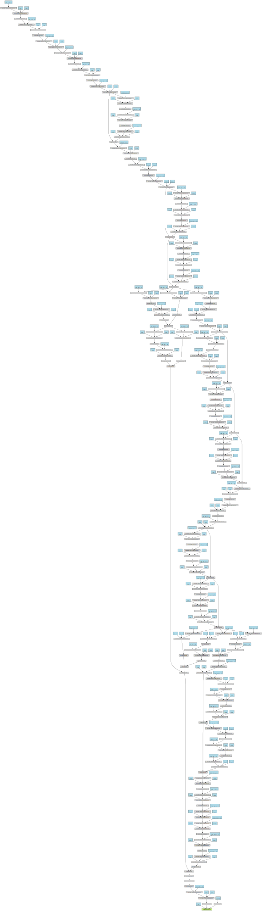
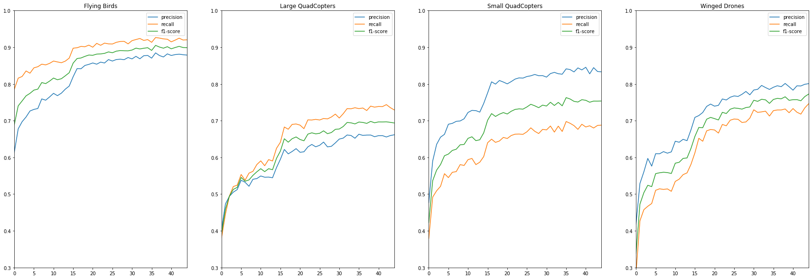
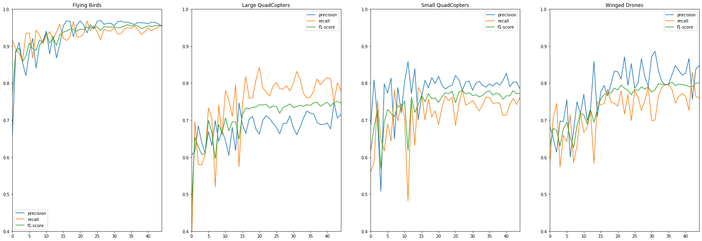
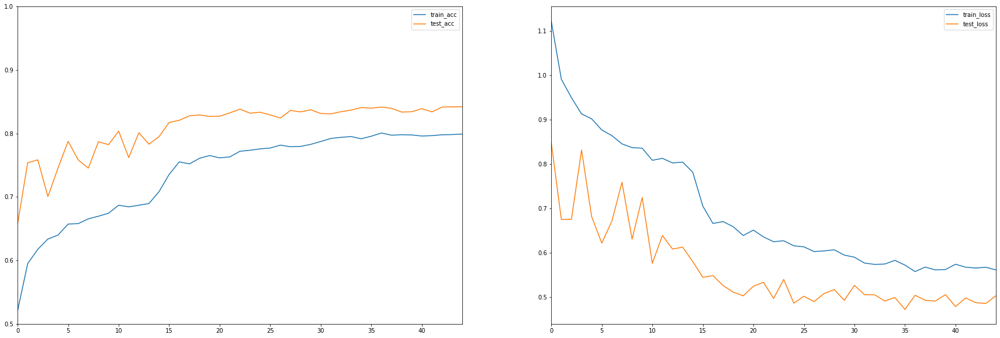
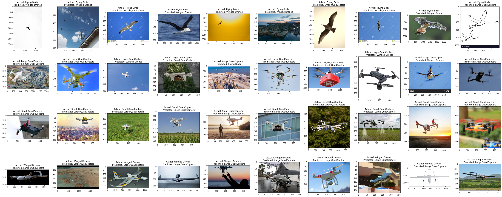

# Assignment 2

## Code
Code is divided into 5 main files
- ```model.py``` 
    - Contains the model that is implemented
- ```dataset.py``` 
    - Contains the dataset class that is implemented as a derived class from ```Dataset``` class from pytorch 
- ```trainer.py```
    - Trains the ```Net``` created in ```model.py```
- ```predictor.py```
    - Loads the model and predicts classes for an image that is provided
- ```handler.py```
    - Implementation of Lambda function for the project.

## Resizing strategy

- **For images smaller than 224X224**
    - Padding if needed to the size of 224X224
- **For images larger than 224X224**
    - Random cropping of 224X224 from the image each time it is trained

## Model

*Mobilenetv2* with extra capacity was implemented :-

Feature extraction was done from 
- Last layer of mobilenet v2
- 6th layer of mobilenet v2 (resolution 28 X 28)
- 13th layer of mobilenet v2 (resolution 14 X 14)
- 18th layer of mobilenet v2 (resolution 7 X 7)

All features were downscaled to 7X7 and concatenated to create the predictor head

- Adaptive global average pooling and one - fully connected layer with 128 X 32 parameters were used in the output layer

```
----------------------------------------------------------------
        Layer (type)               Output Shape         Param #
================================================================
            Conv2d-1          [4, 32, 112, 112]             864
       BatchNorm2d-2          [4, 32, 112, 112]              64
             ReLU6-3          [4, 32, 112, 112]               0
            Conv2d-4          [4, 32, 112, 112]             288
       BatchNorm2d-5          [4, 32, 112, 112]              64
             ReLU6-6          [4, 32, 112, 112]               0
            Conv2d-7          [4, 16, 112, 112]             512
       BatchNorm2d-8          [4, 16, 112, 112]              32
  InvertedResidual-9          [4, 16, 112, 112]               0
           Conv2d-10          [4, 96, 112, 112]           1,536
      BatchNorm2d-11          [4, 96, 112, 112]             192
            ReLU6-12          [4, 96, 112, 112]               0
           Conv2d-13            [4, 96, 56, 56]             864
      BatchNorm2d-14            [4, 96, 56, 56]             192
            ReLU6-15            [4, 96, 56, 56]               0
           Conv2d-16            [4, 24, 56, 56]           2,304
      BatchNorm2d-17            [4, 24, 56, 56]              48
 InvertedResidual-18            [4, 24, 56, 56]               0
           Conv2d-19           [4, 144, 56, 56]           3,456
      BatchNorm2d-20           [4, 144, 56, 56]             288
            ReLU6-21           [4, 144, 56, 56]               0
           Conv2d-22           [4, 144, 56, 56]           1,296
      BatchNorm2d-23           [4, 144, 56, 56]             288
            ReLU6-24           [4, 144, 56, 56]               0
           Conv2d-25            [4, 24, 56, 56]           3,456
      BatchNorm2d-26            [4, 24, 56, 56]              48
 InvertedResidual-27            [4, 24, 56, 56]               0
           Conv2d-28           [4, 144, 56, 56]           3,456
      BatchNorm2d-29           [4, 144, 56, 56]             288
            ReLU6-30           [4, 144, 56, 56]               0
           Conv2d-31           [4, 144, 28, 28]           1,296
      BatchNorm2d-32           [4, 144, 28, 28]             288
            ReLU6-33           [4, 144, 28, 28]               0
           Conv2d-34            [4, 32, 28, 28]           4,608
      BatchNorm2d-35            [4, 32, 28, 28]              64
 InvertedResidual-36            [4, 32, 28, 28]               0
           Conv2d-37           [4, 192, 28, 28]           6,144
      BatchNorm2d-38           [4, 192, 28, 28]             384
            ReLU6-39           [4, 192, 28, 28]               0
           Conv2d-40           [4, 192, 28, 28]           1,728
      BatchNorm2d-41           [4, 192, 28, 28]             384
            ReLU6-42           [4, 192, 28, 28]               0
           Conv2d-43            [4, 32, 28, 28]           6,144
      BatchNorm2d-44            [4, 32, 28, 28]              64
 InvertedResidual-45            [4, 32, 28, 28]               0
           Conv2d-46           [4, 192, 28, 28]           6,144
      BatchNorm2d-47           [4, 192, 28, 28]             384
            ReLU6-48           [4, 192, 28, 28]               0
           Conv2d-49           [4, 192, 28, 28]           1,728
      BatchNorm2d-50           [4, 192, 28, 28]             384
            ReLU6-51           [4, 192, 28, 28]               0
           Conv2d-52            [4, 32, 28, 28]           6,144
      BatchNorm2d-53            [4, 32, 28, 28]              64
 InvertedResidual-54            [4, 32, 28, 28]               0
           Conv2d-55           [4, 192, 28, 28]           6,144
      BatchNorm2d-56           [4, 192, 28, 28]             384
            ReLU6-57           [4, 192, 28, 28]               0
           Conv2d-58           [4, 192, 14, 14]           1,728
      BatchNorm2d-59           [4, 192, 14, 14]             384
            ReLU6-60           [4, 192, 14, 14]               0
           Conv2d-61            [4, 64, 14, 14]          12,288
      BatchNorm2d-62            [4, 64, 14, 14]             128
 InvertedResidual-63            [4, 64, 14, 14]               0
           Conv2d-64           [4, 384, 14, 14]          24,576
      BatchNorm2d-65           [4, 384, 14, 14]             768
            ReLU6-66           [4, 384, 14, 14]               0
           Conv2d-67           [4, 384, 14, 14]           3,456
      BatchNorm2d-68           [4, 384, 14, 14]             768
            ReLU6-69           [4, 384, 14, 14]               0
           Conv2d-70            [4, 64, 14, 14]          24,576
      BatchNorm2d-71            [4, 64, 14, 14]             128
 InvertedResidual-72            [4, 64, 14, 14]               0
           Conv2d-73           [4, 384, 14, 14]          24,576
      BatchNorm2d-74           [4, 384, 14, 14]             768
            ReLU6-75           [4, 384, 14, 14]               0
           Conv2d-76           [4, 384, 14, 14]           3,456
      BatchNorm2d-77           [4, 384, 14, 14]             768
            ReLU6-78           [4, 384, 14, 14]               0
           Conv2d-79            [4, 64, 14, 14]          24,576
      BatchNorm2d-80            [4, 64, 14, 14]             128
 InvertedResidual-81            [4, 64, 14, 14]               0
           Conv2d-82           [4, 384, 14, 14]          24,576
      BatchNorm2d-83           [4, 384, 14, 14]             768
            ReLU6-84           [4, 384, 14, 14]               0
           Conv2d-85           [4, 384, 14, 14]           3,456
      BatchNorm2d-86           [4, 384, 14, 14]             768
            ReLU6-87           [4, 384, 14, 14]               0
           Conv2d-88            [4, 64, 14, 14]          24,576
      BatchNorm2d-89            [4, 64, 14, 14]             128
 InvertedResidual-90            [4, 64, 14, 14]               0
           Conv2d-91           [4, 384, 14, 14]          24,576
      BatchNorm2d-92           [4, 384, 14, 14]             768
            ReLU6-93           [4, 384, 14, 14]               0
           Conv2d-94           [4, 384, 14, 14]           3,456
      BatchNorm2d-95           [4, 384, 14, 14]             768
            ReLU6-96           [4, 384, 14, 14]               0
           Conv2d-97            [4, 96, 14, 14]          36,864
      BatchNorm2d-98            [4, 96, 14, 14]             192
 InvertedResidual-99            [4, 96, 14, 14]               0
          Conv2d-100           [4, 576, 14, 14]          55,296
     BatchNorm2d-101           [4, 576, 14, 14]           1,152
           ReLU6-102           [4, 576, 14, 14]               0
          Conv2d-103           [4, 576, 14, 14]           5,184
     BatchNorm2d-104           [4, 576, 14, 14]           1,152
           ReLU6-105           [4, 576, 14, 14]               0
          Conv2d-106            [4, 96, 14, 14]          55,296
     BatchNorm2d-107            [4, 96, 14, 14]             192
InvertedResidual-108            [4, 96, 14, 14]               0
          Conv2d-109           [4, 576, 14, 14]          55,296
     BatchNorm2d-110           [4, 576, 14, 14]           1,152
           ReLU6-111           [4, 576, 14, 14]               0
          Conv2d-112           [4, 576, 14, 14]           5,184
     BatchNorm2d-113           [4, 576, 14, 14]           1,152
           ReLU6-114           [4, 576, 14, 14]               0
          Conv2d-115            [4, 96, 14, 14]          55,296
     BatchNorm2d-116            [4, 96, 14, 14]             192
InvertedResidual-117            [4, 96, 14, 14]               0
          Conv2d-118           [4, 576, 14, 14]          55,296
     BatchNorm2d-119           [4, 576, 14, 14]           1,152
           ReLU6-120           [4, 576, 14, 14]               0
          Conv2d-121             [4, 576, 7, 7]           5,184
     BatchNorm2d-122             [4, 576, 7, 7]           1,152
           ReLU6-123             [4, 576, 7, 7]               0
          Conv2d-124             [4, 160, 7, 7]          92,160
     BatchNorm2d-125             [4, 160, 7, 7]             320
InvertedResidual-126             [4, 160, 7, 7]               0
          Conv2d-127             [4, 960, 7, 7]         153,600
     BatchNorm2d-128             [4, 960, 7, 7]           1,920
           ReLU6-129             [4, 960, 7, 7]               0
          Conv2d-130             [4, 960, 7, 7]           8,640
     BatchNorm2d-131             [4, 960, 7, 7]           1,920
           ReLU6-132             [4, 960, 7, 7]               0
          Conv2d-133             [4, 160, 7, 7]         153,600
     BatchNorm2d-134             [4, 160, 7, 7]             320
InvertedResidual-135             [4, 160, 7, 7]               0
          Conv2d-136             [4, 960, 7, 7]         153,600
     BatchNorm2d-137             [4, 960, 7, 7]           1,920
           ReLU6-138             [4, 960, 7, 7]               0
          Conv2d-139             [4, 960, 7, 7]           8,640
     BatchNorm2d-140             [4, 960, 7, 7]           1,920
           ReLU6-141             [4, 960, 7, 7]               0
          Conv2d-142             [4, 160, 7, 7]         153,600
     BatchNorm2d-143             [4, 160, 7, 7]             320
InvertedResidual-144             [4, 160, 7, 7]               0
          Conv2d-145             [4, 960, 7, 7]         153,600
     BatchNorm2d-146             [4, 960, 7, 7]           1,920
           ReLU6-147             [4, 960, 7, 7]               0
          Conv2d-148             [4, 960, 7, 7]           8,640
     BatchNorm2d-149             [4, 960, 7, 7]           1,920
           ReLU6-150             [4, 960, 7, 7]               0
          Conv2d-151             [4, 320, 7, 7]         307,200
     BatchNorm2d-152             [4, 320, 7, 7]             640
InvertedResidual-153             [4, 320, 7, 7]               0
          Conv2d-154            [4, 1280, 7, 7]         409,600
     BatchNorm2d-155            [4, 1280, 7, 7]           2,560
           ReLU6-156            [4, 1280, 7, 7]               0
          Conv2d-157            [4, 64, 14, 14]           2,048
     BatchNorm2d-158            [4, 64, 14, 14]             128
            ReLU-159            [4, 64, 14, 14]               0
          Conv2d-160            [4, 64, 14, 14]           2,048
     BatchNorm2d-161            [4, 64, 14, 14]             128
            ReLU-162            [4, 64, 14, 14]               0
          Conv2d-163            [4, 64, 14, 14]          36,864
     BatchNorm2d-164            [4, 64, 14, 14]             128
            ReLU-165            [4, 64, 14, 14]               0
          Conv2d-166              [4, 64, 7, 7]           8,192
     BatchNorm2d-167              [4, 64, 7, 7]             128
            ReLU-168              [4, 64, 7, 7]               0
          Conv2d-169              [4, 64, 7, 7]           8,192
     BatchNorm2d-170              [4, 64, 7, 7]             128
            ReLU-171              [4, 64, 7, 7]               0
          Conv2d-172              [4, 64, 7, 7]          36,864
     BatchNorm2d-173              [4, 64, 7, 7]             128
            ReLU-174              [4, 64, 7, 7]               0
          Conv2d-175              [4, 64, 7, 7]           6,144
     BatchNorm2d-176              [4, 64, 7, 7]             128
            ReLU-177              [4, 64, 7, 7]               0
          Conv2d-178              [4, 64, 7, 7]           6,144
     BatchNorm2d-179              [4, 64, 7, 7]             128
            ReLU-180              [4, 64, 7, 7]               0
          Conv2d-181              [4, 64, 7, 7]          36,864
     BatchNorm2d-182              [4, 64, 7, 7]             128
            ReLU-183              [4, 64, 7, 7]               0
          Conv2d-184             [4, 128, 7, 7]         163,840
     BatchNorm2d-185             [4, 128, 7, 7]             256
            ReLU-186             [4, 128, 7, 7]               0
          Conv2d-187             [4, 128, 7, 7]         147,456
     BatchNorm2d-188             [4, 128, 7, 7]             256
            ReLU-189             [4, 128, 7, 7]               0
AdaptiveAvgPool2d-190             [4, 128, 1, 1]               0
          Conv2d-191              [4, 32, 1, 1]           4,096
     BatchNorm2d-192              [4, 32, 1, 1]              64
          Linear-193                     [4, 4]             132
================================================================
Total params: 2,684,484
Trainable params: 2,684,484
Non-trainable params: 0
----------------------------------------------------------------
Input size (MB): 2.30
Forward/backward pass size (MB): 617.72
Params size (MB): 10.24
Estimated Total Size (MB): 630.26
----------------------------------------------------------------
```

- ### Full result
    

## Accuracy vs epochs graphs for train and test curves

- Classwise **train** precision, recall and f1-score


- Classwise **test** precision, recall and f1-score


- **Accuraccy** and **loss** for **train** and **test**


## 10 misclassified images for each of the classes as an Image Gallery
