# Assignment 3

## Code
Code is divided into 3 main folders
- ```face-align``` 
    - Face align Lambda deployment
- ```resnet``` 
    - Resnet based detection Lambda deployment 
- ```site```
    - Static website hosted in S3 linked to the different endpoints

**Face detection**, **Face alignment** and **Face swap** are implemented in [```EVA_Assignment_3_Face_Detection_and_Face_Swap.ipynb```](https://github.com/truehunch/eva-p2/blob/master/A3/EVA_Assignment_3_Face_Detection_and_Face_Swap.ipynb)

## Website

- [Link](https://eva4-p2-website.s3.ap-south-1.amazonaws.com/index.html) to website
- **Screenshot of landng page**
    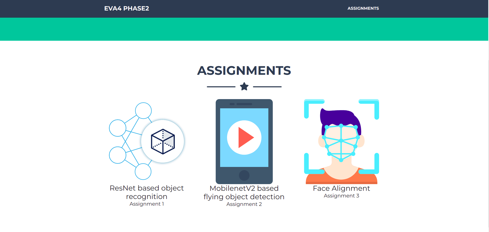
    - 3 card style entries for the 3 different tasks
- **Resnet based object recognition**
    - Uploading and drag and drop files to get predictions from Resnet Lambda model implemented
    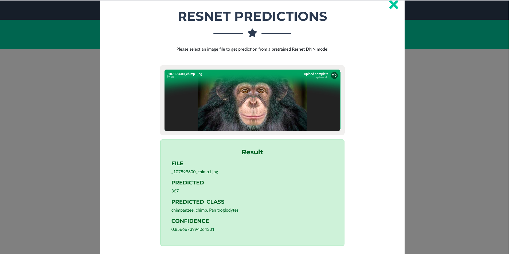
- **Mobilenet V2 based flight dataset classification**
    - Classification into 
      - Small Quads
      - Large Quads
      - Winged Drones
      - Flying Birds 
     - Achieved with custom mobilenetV2 model on Lambda 
    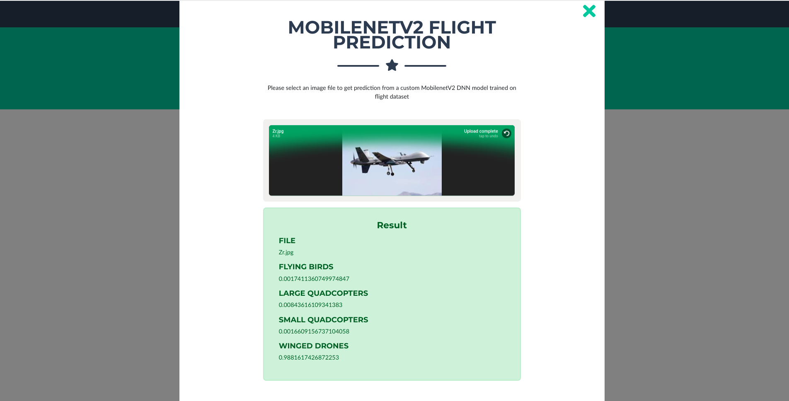
- **Face alignment**
     Steps involved are
     - Face detection with ```dlib```
     - 68 point model based labdmark detection on the selected model
     - Transformation matrix computation with 3 points taken from source and target(left - eye corner, right - eye corner and a triangulated point equidistant from both of them)
     - Warping source image based on the transformation
    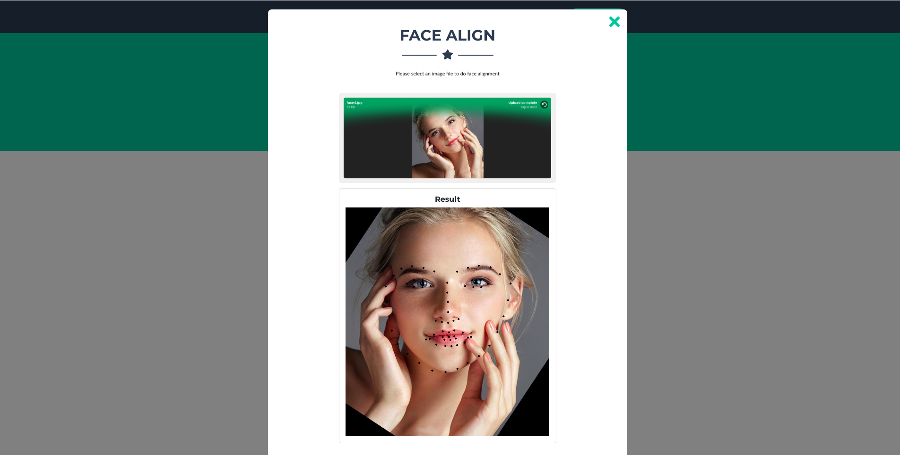

## Face detection

Face detection implemented with the help of ```dlib``` on Lambda
     - 68 point landmark detection model also was done on the deected face
| Input image |  Detected face and landmarks |
|---|---|
| 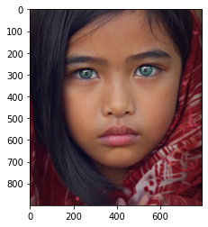 |  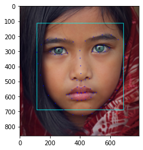 |

## Face alignment

| Input image |  Aligned face |
|---|---|
| 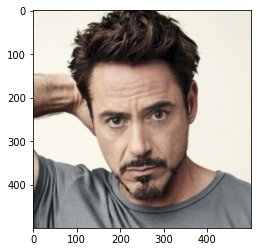 |  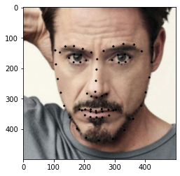 |

## Face swap

- Step 1 : Source and target **face detection**, **face alignment** and **landmark extraction**. For convenience we have taken Donald.J.Trump as the target image and Barak Obama as the source

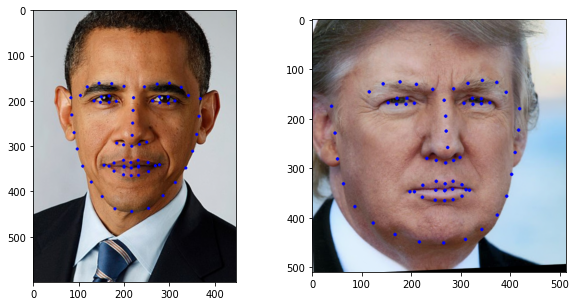

- Step 2 : **Convex hull extraction** from the target image and mask creation to perform seamless cloning later

| Convex hull |  Mask |
|---|---|
| 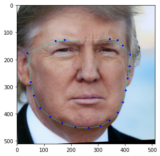 |  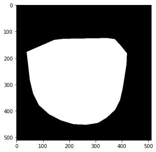 |

- Step 3: **Delaunay triangulation** based on the landmarks detected from aligned faces
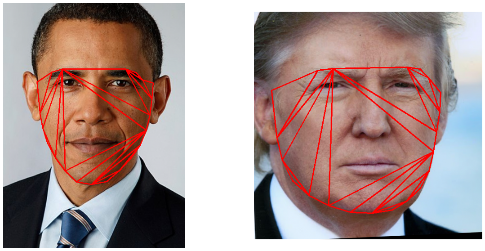

- Step 4: Perform **affine transformations** on the traingulated points to match the target image mask area
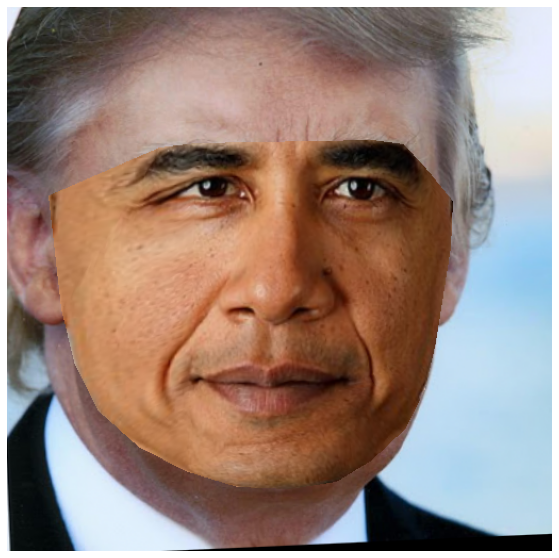

- Step 5: Perform **seamless cloning** between the target and the source image based on previously created mask and we have **Trobama**!
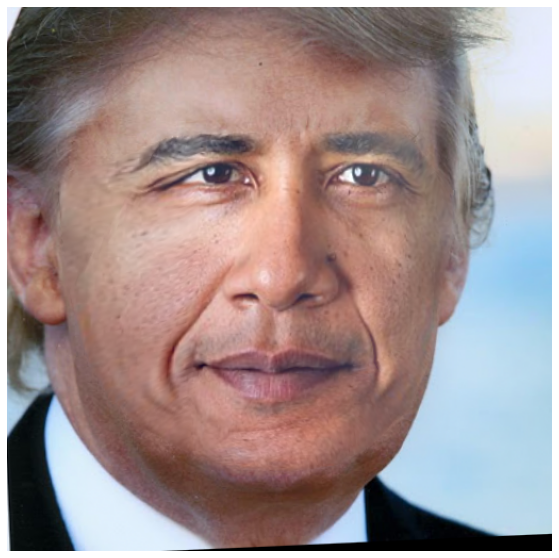