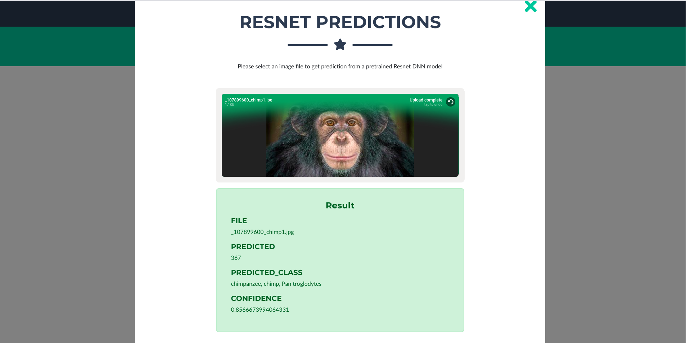

# Assignment 4

## Code
Code is divided into 3 main files
- ```EVA_Assignment_4_Face_Recognition_Dataset_creation.ipynb``` 
    - Code that creates the dataset for custom face to be added to dataset
- ```EVA_Assignment_4_Face_Recognition_Training.ipynb``` 
    - Training facenet for custom faces
- ```handler```
    - Lambda deployment of the model

## Website

- [Link](https://eva4-p2-website.s3.ap-south-1.amazonaws.com/index.html) to website
- **Screenshot of landng page**
    
    - 3 card style entries for the 3 different tasks
- **Resnet based object recognition**
    - Uploading and drag and drop files to get predictions from Resnet Lambda model implemented
    
- **Mobilenet V2 based flight dataset classification**
    - Classification into 
      - Small Quads
      - Large Quads
      - Winged Drones
      - Flying Birds 
     - Achieved with custom mobilenetV2 model on Lambda 
    
- **Face alignment**
     Steps involved are
     - Face detection with ```dlib```
     - 68 point model based labdmark detection on the selected model
     - Transformation matrix computation with 3 points taken from source and target(left - eye corner, right - eye corner and a triangulated point equidistant from both of them)
     - Warping source image based on the transformation
    
- **Face recognition**
     Stps involved are
     - Face recognition with custom trained Facenet
    