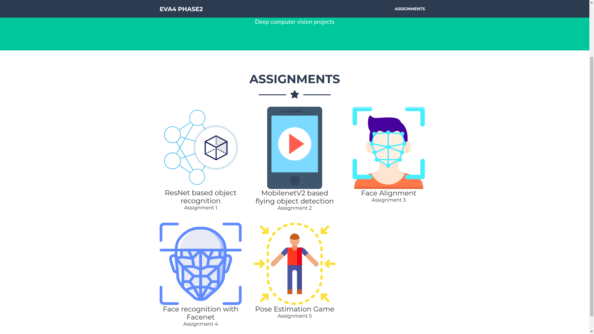
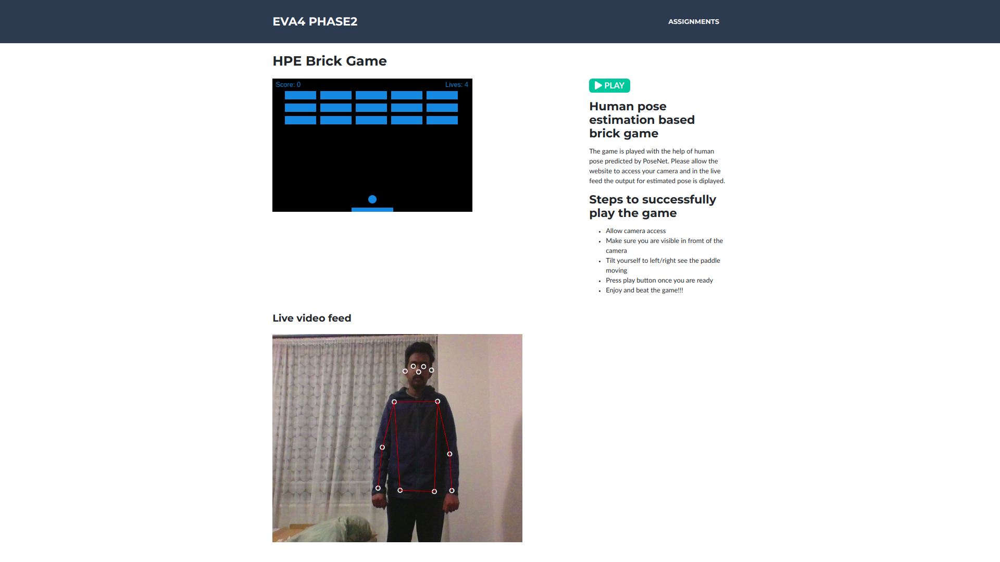

# Assignment 5

## Pose estimation based brick game

## Code

Code is implemented in javascript using tensorflow.js as the backend.
This [tf.js](https://github.com/tensorflow/tfjs-models/tree/master/posenet/demos) repository was used to perform pose estimation. A MobilenetBackend based PoseNet was used for the implementation.

## Website

- [Link](https://eva4-p2-website.s3.ap-south-1.amazonaws.com/index.html) to website

- **Screenshot of landng page**
    
    - The pose estimation card implements the game
- **Mobilenet V2 backend based poseNet on tf.js**
    - A screenshot of the website is given below
    
    - The implementation integrates pose estimation with a standard brick game.
    - The player's pose is first pedicted with the model.
    - As a second step, corresponding pairs of identified body parts are matched with a prediction confidence threshold of 75%.
    - Corresponding body parts are listed below
        | Left part | <-> |  Right part |
        | --- | --- | --- |
        | leftEye      | <-> |  rightEye        |
        | leftEar      | <-> |  rightEar        |
        | leftShoulder | <-> |  rightShoulder   |
        | leftElbow    | <-> |  rightElbow      |
        | leftWrist    | <-> |  rightWrist      |
        | leftHip      | <-> |  rightHip        |
        | leftKnee     | <-> |  rightKnee       |
        | leftAnkle    | <-> |  rightAnkle      |
    - Once matched body parts pairs are found the slope between each predicted body part pair is found by,
    ```
    slope = (left_part_x - right_part_x) / (left_part_y - right_part_y) 
    ```
    - All obtained slopes are averaged to compute the overall tilt of the body.

- **Brick game paddle movement**
    - Once the slope is found out by the previous step, an average smoothened value of the slope is used to determine if the paddle is to move to the left and right.
    - Small slopes are neglected with a threshold of 0.1 i.e approximately 6 degrees, stabilizes the paddle for small jerks in movement.

A video demonstration on how to play the game is given in the below link!!!.

[]()
